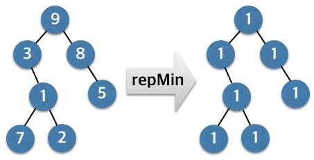
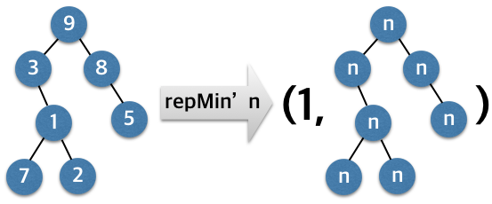
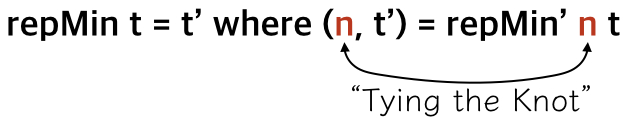

###Circular Programming
Haskell 의 느긋한 계산법은 다음과 같은 직관적이지 않은 코드를 작성할 수 있게 합니다. 아래 코드에서 변수 x 와 y 는 서로 상호 참조하고 있습니다.
```haskell
cyclic = let x = 0:y
             y = 1:x
         in x
```

    > take 10 cyclic
    [0,1,0,1,0,1,0,1,0,1]

위 코드가 전개되는 과정을 표현해보면 다음과 같습니다. 보면 변수 x 와 y 각각의 한 쪽 끝을 다른 변수로 연결하는 것처럼 전개가 됩니다. 이러한 모습에서 이런 재귀적인 코드를 **"Tying the Knot"** 라는 말로 표현하기도 합니다.

cyclic = x = 0:y = 0:1:x *`(<-- 매듭! 다시 처음으로 되돌아갔습니다)`* = 0:1:0:y = ...

다른 예를 보겠습니다. Repmin 문제라고 하는데, Tree 자료구조에서 노드의 모든 값을 해당 Tree 의 가장 작은 값으로 바꾸는 문제입니다.

```haskell
data Tree = Leaf | Fork Int Tree Tree deriving Show

t1 = Fork 9 (Fork 3 Leaf (Fork 1 (Fork 7 Leaf Leaf) (Fork 2 Leaf Leaf)))
            (Fork 8 Leaf (Fork 5 Leaf Leaf))

repMin:: Tree -> Tree
repMin = undefined
```
위처럼 t1 이라는 Tree 가 있을 때 t1 의 모든 값을 가장 작은 값인 1 로 바꾸는 것입니다. 아래 그림처럼.



이렇게 하려면 Tree 를 한 번 순회하면서 최소 값을 구한 다음 다시 Tree 를 순회하면서 모든 Node 의 값을 첫번째 Tree 순회에서 구한 최소값으로 바꾸면 됩니다. 즉, Tree 순회를 두 번 합니다. 그런데 느긋한 계산법을 이용하면 Tree 순회 한 번에 원하는 결과를 얻을 수 있습니다. 어떻게 그리 할 수 있을까요? 이 방법을 이해하기 위해 좀 더 쉬운 문제를 먼저 풀어보겠습니다. repMin 함수 대신 다음 그림과 같은 기능을 수행하는 repMin' 함수를 만들어보겠습니다.



repMin' 함수는 주어진 인자 n 으로 Tree 의 모든 값을 바꿔치고 동시에 Tree 에서 가장 작은 값을 구합니다. repMin' 함수의 type 을 써 보면 다음과 같습니다. 결과를 tuple 로서 반환하는데 tuple 의 첫번째 원소가 Tree 의 최소값이고 두번째 원소는 새로운 Tree 입니다.

    repMin':: Int -> Tree -> (Int, Tree)

이 함수의 구현은 다음처럼 Tree 를 순회하면서 값을 갱신하면서 동시에 최소값을 계속 비교하면 됩니다.
```haskell
repMin':: Int -> Tree -> (Int, Tree)
repMin' _ Leaf = (maxBound::Int, Leaf)
repMin' n (Fork m l r) =
  (minimum [m, left_min, right_min], Fork n l' r')
  where (left_min, l') = repMin' n l
        (right_min, r') = repMin' n r
```
이 코드를 보면 repMin' 함수의 실행은 다음과 같은 모습이 됩니다.

    (n, t') = repMin' m t

여기서 n 은 Tree t 에서 가장 작은 값을 뜻하고 t' 는 Tree t 의 모든 값을 m 으로 갈아치운 Tree t' 입니다. 이제 repMin' 을 이용하여 다음과 갈은 순환 구조를 만들 수 있습니다.



