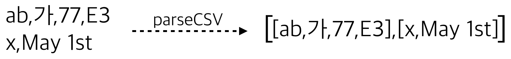
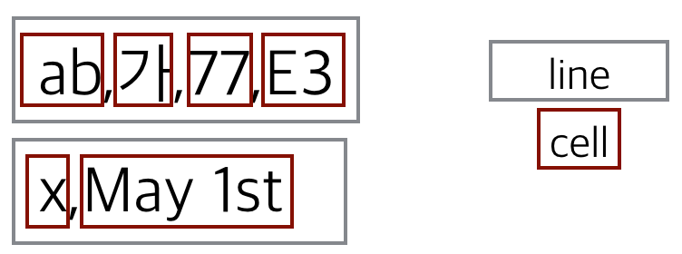

###Parsec 배우기
Parsec 라이브러리를 쓰면 파싱(parsing) 작업을 매우 효율적으로 처리할 수 있습니다. 먼저 파싱이란 무엇인지에 대해 생각해 봅시다.

파싱을 아주 단순하게 표현해 보면, 임의의 문자열을 입력으로 받아서 해당 문자열에서 특정 pattern 을 찾아내는 것이라고 할 수 있습니다. 조금 더 설명을 덧붙여 보면 입력 문자열에서 특정 pattern 을 찾을 수 있을 만큼 찾고나서 찾은 pattern 과 분석하지 못하고 남은 문자열을 함께 돌려주는 것이라고 할 수 있습니다. 이 설명을 type 으로 옮겨보면 다음과 같습니다.
```haskell
type Parser s a = s -> (a, s)
```
여기서 s 는 입력을, a 는 찾고자 하는 pattern 을 뜻합니다. 그런데 하나 더 고려해야 할 게 있습니다. 바로 파싱이 항상 성공하는건 아니라는 것입니다. 따라서 성공할 수도 실패할 수도 있는 값을 뜻하는 Maybe 를 씌워야 합니다. 이제 다음처럼 type 을 바꿉니다.
```haskell
type Parser s a = s -> Maybe (a, s)
```
이제 아주 간단한 Parser 하나를 만들어 보겠습니다. 입력 문자열이 특정 pattern 으로 시작하는지 검사하는 Parser 입니다.
```haskell
import Data.List (stripPrefix)

type Parser s a = s -> Maybe (a,s)

stringBegins :: String -> Parser String String
stringBegins pattern = \input ->
  case stripPrefix pattern input of
    Nothing   -> Nothing
    Just rest -> Just (pattern, rest)
```

    > stringBegins "abc" "abcd"
    Just ("abc","d")
    > stringBegins "abc" "axyzbc"
    Nothing

이번에는 문자열 처음에서 숫자부분을 검사하는 Parser 를 만들겠습니다. 위의 파서만큼 간단합니다.
```haskell
import Data.List (span)
import Data.Char (isDigit)

number:: Parser String Int
number input =
  if h == "" then Nothing else Just (read h::Int, t)
  where (h, t) = span isDigit input
```

    > number "98abc"
    Just (98,"abc")
    > number "abc98"
    Nothing

이렇게 만든 stringBegins, number 두 개의 파서를 가지고 다음처럼 동작하는 version 이라는 아주 간단한 파서를 만들어봅니다.

    > version "version 8.0.1" -- 이 함수의 결과는 (8,0,1) 이면 될 것 같습니다.

단순하게는 다음처럼 만들 수 있습니다.
```haskell
version1 i0 =
  case stringBegins "version " i0 of
    Nothing -> Nothing
    Just (_,i1) ->
      case number i1 of
        Nothing -> Nothing
        Just (major,i2) ->
          case stringBegins "." i2 of
            Nothing -> Nothing
            Just (_,i3) ->
              case number i3 of
                Nothing -> Nothing
                Just (minor,i4) ->
                  case stringBegins "." i4 of
                    Nothing -> Nothing
                    Just (_,i5) ->
                      case number i5 of
                        Nothing -> Nothing
                        Just (revision,i6) -> Just((major,minor,revision),i6)
```
이제 좀 더 나은 방법으로 다시 작성하려보니 위 코드는 다음과 같은 패턴의 반복임을 알 수 있습니다.

Parser 에 입력을 준다 → Parser 는 입력을 분석해서 찾으려는 패턴을 찾는다 → 찾으려는 패턴을 찾아서 분석이 성공하면 입력에서 남은 부분을 다음 Parser 로 넘긴다

이 패턴을 함수로 만들어보면 다음과 같습니다. 함수 이름은 andThen 으로 하겠습니다.
```haskell
andThen :: Parser s a -> (a -> Parser s b) -> Parser s b
andThen parse next = \input ->
  case parse input of
    Nothing          -> Nothing
    Just (a, input') -> next a input'
```
이제 이 함수를 이용해서 version 함수를 다시 써보면 다음과 같습니다.
```haskell
version2 =
  stringBegins "version " `andThen` \_ ->
  number `andThen` \major ->
  stringBegins "." `andThen` \_ ->
  number `andThen` \minor ->
  stringBegins "." `andThen` \_ ->
  number `andThen` \revision ->
  {- ... (major, minor, revision) 결과를 돌려주는 코드 ...-}
```
위 코드의 마지막 줄에서 결과를 돌려줄 때는 Parser 에 담아서 돌려주므로 이를 위한 함수도 따로 만듭니다. 함수 이름은 pack 으로 하겠습니다.
```haskell
pack :: a -> Parser s a
pack a = \input -> Just (a, input)
```
이제 코드를 붙여보면 다음과 같습니다.
```haskell
version2 =
  stringBegins "version " `andThen` \_ ->
  number `andThen` \major ->
  stringBegins "." `andThen` \_ ->
  number `andThen` \minor ->
  stringBegins "." `andThen` \_ ->
  number `andThen` \revision ->
  pack (major, minor, revision)
```
여기서 만든 andThen 함수와 pack 함수가 어디 다른 곳에서 보았던 것과 비슷하다고 느낀다면 그 느낌이 맞습니다. 다음 코드를 보십시요.
```haskell
-- andThen 과 (>>=) 이 같은 꼴입니다.
andThen :: Parser s a -> (a -> Parser s b) -> Parser s b
(>>=)   :: Monad m =>
           m        a -> (a -> m        b) -> m        b

-- pack 과 return 이 같은 꼴입니다.
pack   ::            a -> Parser s a
return :: Monad m => a -> m        a
```
그렇습니다. Parser 는 사실 Monad 입니다. 그런데 앞서 우리가 Parser 를 type synonym 으로 정의했기 때문에 현재 상태에서는 이를 Monad 의 Instance 로 만들 수 없습니다. 왜냐하면 type synonym 은 어떠한 typeclass 에도 속할 수 없기 때문입니다. 따라서 Parser 를 다음처럼 새로운 자료형으로 정의하도록 합니다.
```haskell
newtype Parser s a = Parser {runParser :: s -> Maybe (a, s)}
```
이제 Parser 를 Monad 의 Instance 로 만들 수 있습니다.
```haskell
instance Monad (Parser s) where
  (>>=) = parserBind
  return = parserReturn

{- 앞서 구현했던 함수와 비교해 보세요. newtype 관련 부분을 빼곤 다를 게 없습니다.
pack         a =          \input -> Just (a, input)                            -}
parserReturn a = Parser $ \input -> Just (a, input)

{- 앞서 구현했던 함수와 비교해 보세요. newtype 관련 부분을 빼곤 다를 게 없습니다.
andThen    parse next =          \input ->
  case           parse input of
    Nothing          -> Nothing
    Just (a, input') ->            next a  input'                              -}
parserBind parse next = Parser $ \input ->
  case runParser parse input of
    Nothing          -> Nothing
    Just (a, input') -> runParser (next a) input'
```
(연습) Parser 를 Monad 의 Instance 로 만들었기 때문에 Parser 를 Applicative 와 Functor 의 instance 로도 만들어야 합니다. 아래 코드에서 Functor 로 만드는 코드를 완성해 보세요.
```haskell
import Control.Monad (ap)

instance Functor (Parser s) where
  fmap f parser = Parser $ \input -> ?

instance Applicative (Parser s) where
  pure = return
  (<*>) = ap
```
stringBegins 함수와 number 함수도 바뀐 사항에 맞추어 다시 작성합니다.
```haskell
import Data.List (stripPrefix, span)
import Data.Char (isDigit)

stringBegins :: String -> Parser String String
stringBegins pattern = Parser $ \input ->
  case stripPrefix pattern input of
    Nothing   -> Nothing
    Just rest -> Just (pattern, rest)

number:: Parser String Int
number = Parser $ \input ->
  let (h, t) = span isDigit input
    in if h == "" then Nothing else Just (read h::Int, t)
```
이제 지금까지의 구현 사항을 이용하여 version 함수를 다음처럼 do notation 을 써서 더 간단하게 만들 수 있습니다.
```haskell
version3 = do
  stringBegins "version "
  major <- number
  stringBegins "."
  minor <- number
  stringBegins "."
  revision <- number
  return (major,minor,revision)
```
또는 Applicative 임을 이용하여 다음처럼 할 수도 있습니다.
```haskell
version4 = (,,) <$>
           (stringBegins "version " *> number <* stringBegins ".") <*>
           (number <* stringBegins ".") <*>
           number
```

    > runParser version4 "version 8.0.1"
    Just ((8,0,1),"")

추가로 하나 더 해볼것은 첫번째 Parser 가 실패했을 때 두번째 Parser 를 이용하도록 하는 것입니다. 즉, Parser 를 Alternative typeclass 의 Instance 로 만드는 것입니다. 먼저 Alternative typeclass 의 정의를 보겠습니다.
```haskell
class Applicative f => Alternative f where
  empty :: f a
  (<|>) :: f a -> f a -> f a
```
이제 다음처럼 empty 함수와 (<|>) 함수를 구현합니다.
```haskell
import Control.Applicative

instance Alternative (Parser s) where
  empty = Parser $ \_ -> Nothing

  f <|> g = Parser $ \input ->
    case runParser f input of
      Nothing -> runParser g input
      result  -> result
```
이렇게 했을 때의 동작은 다음과 같습니다.

    > let p = stringBegins "foo" <|> stringBegins "bar"
    > runParser p "foowhee"
    Just ("foo","whee")
    > runParser p "quuxly"
    Nothing
    > runParser p "barely"
    Just ("bar","ely")

여기까지 다룬 내용이 바로 Parsec 라이브러리가 어떻게 구현되어 있는지에 대한 간략한 소개입니다. 이제 실제로 Parsec 을 이용하는 코드를 살펴보겠습니다.

####Parsec combinators
우선 다음 함수들에 대해 알아보겠습니다.

- [x] char
- [x] many, many1
- [x] anyChar
- [x] letter, digit
- [x] noneOf, oneOf
- [x] string

Parsec 라이브러리를 사용하려면 Text.Parsec 모듈을 import 합니다.

    > import Text.Parsec
    > :set -XFlexibleContexts
    > let aParser = char 'a'
    > parse aParser "STDIN.." "abc"
    Right 'a'

위 코드에서는 Text.Parsec 모듈에서 제공하는 **char** parser 를 이용하여 문자 'a' 를 파싱하는 aParser 를 하나 만들었습니다. 그리고 parse 함수를 이용하여 aParser 를 실행하였습니다. 입력 "abc" 를 주었더니 이를 파싱하여 결과로 Right 'a' 를 내놓았습니다. 참고로 parse 함수는 세 개의 인자를 받는데 뜻하는 바는 다음과 같습니다.

    parse parser filePath input

두번째 인자의 경우(위의 예시 코드에서 "STDIN.."에 해당하는 인자)는 input 의 파일경로를 뜻하며 파싱 실패시 에러메시지에서 사용합니다. 파싱이 실패하는 다음 경우에 이를 확인할 수 있습니다.

    > parse aParser "STDIN.." "bc"
    Left "STDIN.." (line 1, column 1):
    unexpected "b"
    expecting "a"

**char** parser 는 문자 하나를 파싱하는데 "aaa" 같은 같은 문자가 여러개 있는 것을 파싱하려면 **many** combinator 와 조합하여 사용하면 됩니다.

    > parse (many aParser) "STDIN.." "aaabc"
    Right "aaa"
    > parse (many aParser) "STDIN.." "xyz"
    Right ""

여기서 한 가지 알 수 있는 점은 **many** combinator 는 절대로 실패하는 경우가 없다는 점입니다. 일치하는 경우가 전혀 없을 때는 실패하는 대신 빈 결과를 돌려줍니다. 적어도 하나는 일치해야만 파싱이 성공하는 것으로 처리하고 싶을 때는 **many1** combinator 를 씁니다.

    > parse (many1 aParser) "STDIN.." "xyz"
    Left "STDIN.." (line 1, column 1):
    unexpected "x"
    expecting "a"

문자로 된 것은 모두 파싱하려면 **anyChar** parser 를 이용합니다.

    > parse (many anyChar) "STDIN.." "abc"
    Right "abc"
    > parse anyChar "STDIN.." "xyz"
    Right "x"

모든 문자 말고 영문자만 파싱하려면 **letter**, 숫자만 파싱하려면 **digit** parser 를 이용합니다.

    > parse (many letter) "STDIN.." "ab23c"
    Right "ab"
    > parse (many digit) "STDIN.." "12ab3"
    Right "12"

몇몇만 제외하고 파싱할 때는 **noneOf** parser 를 이용합니다.

    > parse (many $ noneOf "., ") "STDIN.." "abc xyz"
    Right "abc"

이와 반대되는 것으로 **oneOf** parser 가 있습니다.

    > parse (many $ oneOf "abc") "STDIN.." "cba xyz"
    Right "cba"

특정 문자열을 파싱하려면 **string** parser 를 이용합니다.

    > parse (string "abc") "STDIN.." "abcdef"
    Right "abc"

이제 작은 프로그램을 하나 만들어보겠습니다.

####CSV parser 만들기

- [x] endBy, sepBy

parseCSV 함수는 CSV 문자열을 받아서 이를 List of List of String 으로 파싱하도록 하겠습니다. 아래 그림처럼.

다음은 parseCSV 함수의 type입니다. 파싱이 실패할 경우에는 parse error 를 보여주는데 type 은 Text.Parsec.Error 모듈에 미리 정의되어 있는 ParseError 자료형입니다.
```haskell
parseCSV :: String -> Either ParseError [[String]]
```
이제 parseCSV 함수를 구현하는데 앞서의 경우처럼 parse 함수에 csvParser 를 넘기는 꼴이 될 것입니다. 아래 코드처럼.
```haskell
parseCSV = parse csvParser ""
```
이제 csvParser 를 구현할텐데 우선 CSV 파일을 다음과 같은 구조로 생각해 볼 수 있습니다.


즉, CSV 파일은 newline 으로 구분이 되는 line 들의 연속으로 이루어져 있고 각각의 line 들은 쉼표로 구분이 되는 cell 로 이루어져 있는 것입니다. 이 구조를 코드로 옮겨보면 우선 line 을 반복적으로 파싱을 하는 부분이 들어갑니다. 이 때 필요한 것이 **endBy** combinator 입니다.

    > parse (endBy (many letter) (char ',')) "" "ab,cd,ef,"
    Right ["ab","cd","ef"]

**endBy** combinator 는 두 개의 parser 를 인자로 받는데 첫번째 인자는 얻고자 하는 내용에 관한 parser 이고 두 번째 인자는 separator 를 파싱하는 parser 입니다. 이제 **endBy** 를 사용하여 CSV 의 line 을 반복적으로 파싱하는 부분을 작성해보면 다음과 같습니다.
```haskell
csvParser = endBy lineParser eol
eol = char '\n' -- for parsing an 'end of line'
```
다음으로 lineParser 를 구현해야 하는데 이는 cell 을 반복적으로 파싱하는 일을 한다고 했습니다. 이 때 **endBy** combinator 와 거의 같은 combinator 를 쓰는데 바로 **sepBy** 입니다.

    > parse (sepBy (many letter) (char ',')) "" "ab,cd,ef,"
    Right ["ab","cd","ef",""]
    > parse (sepBy anyChar (char ',')) "" "a,b,c"
    Right "abc"

**sepBy** 와 **endBy** 의 차이는 파싱할 내용의 마지막에 separator 가 있느냐 없느냐의 차이입니다. **sepBy** 는 말 그대로 항목들이 구분자에 의해 분리되어 있는 형태를 입력으로 가정합니다. 이를 사용하여 하나의 line 에서 cell 을 반복적으로 파싱하는 일을 하는 lineParser  구현해 보면 다음과 같습니다.
```haskell
lineParser = sepBy cellParser delimiter
delimiter = char ','
```
마지막으로 cellParser 는 구분자로 사용되는 쉼표와 'end of line' 문자를 빼고 모두 파싱을 합니다. 따라서 앞서 배웠던 many 와 noneOf 를 사용하여 다음처럼 작성할 수 있습니다.
```haskell
cellParser = many (noneOf ",\n")
```
이제 모든 것을 한 곳에 모아보겠습니다.
```haskell
import Text.Parsec

csvParser = endBy lineParser eol
lineParser = sepBy cellParser delimiter
cellParser = many (noneOf ",\n")
eol = char '\n'
delimiter = char ','

parseCSV = parse csvParser "STDIN.."
```

####CSV Parser 만들기 계속

- [x] try
- [x] <?>

앞서 만든 파서는 기본적인 동작은 하지만 모든 상황을 다 고려해서 작성하지는 못했습니다. 우선 새줄 문자로 어떤 것을 사용하는지는 OS 마다 다릅니다. Linux 및 Unix 계열 그리고 OS X 이후의 맥 운영체제는 '\n' 을 사용하지만 구형 맥 OS 는 '\r' 을 사용하고 Windows 는 "\r\n" 을 사용합니다. 따라서 eol 정의를 바꾸어주어야 합니다. 앞서 Alternative typeclass 를 다룰 때 나왔던 (<|>) 함수를 이용하면 다음처럼 써 볼 수 있을 것 같습니다.
```haskell
eol = string "\r" <|> string "\n" <|> string "\r\n"
```
그런데 딱 봐도 이건 "\r\n" 의 경우 "\r" 에서 먼저 걸리기 때문에 제대로 된 구현이 아닙니다.

    > parse eol "" "\r\n"
    Right "\r"

그렇다면 순서를 바꿔보면 괜찮을까요?
```haskell
eol = string "\r\n" <|> string "\r" <|> string "\n"
```
이번에는 다른 경우에 문제가 됩니다. 다음처럼.

    > parse eol "" "\r"
    Left (line 1, column 1):
    unexpected end of input
    expecting "\r\n"

애초에 이 문제를 제대로 풀려면 파싱하려고 입력에서 문자 하나를 봤을 때 그 다음에 올 문자가 뭔지 역시 확인해봐야 합니다. 이러한 일(lookahead)을 해주는 것이 **try** combinator 입니다.
```haskell
eol = try (string "\r\n") <|> string "\r" <|> string "\n"
```
parse try p 의 동작은 parse p 의 동작과 비슷한데 다만 에러가 발생했을 때 입력의 상태가 다릅니다. parse p 의 경우 에러 발생시 남아있는 입력이 원래 입력보다 짧지만(파서가 소비했기 때문에) parse try p 는 원래 입력 상태 그래로 남아있습니다.

마지막으로 새줄문자를 아예 찾지 못했을 경우도 가정해야 합니다. 이러한 경우에 사용자가 지정한 오류메시지를 출력하려면 **<?>** combinator 를 사용합니다. 다음처럼.
```haskell
eol =   try (string "\r\n")
    <|> string "\r"
    <|> string "\n"
    <?> "end of line"
```
####CSV Parser 만들기 완결
- [x] between

마지막으로 고려해야 할 점은 쉼표가 구분자가 아니라 그 자체로서 내용으로 있는 경우입니다. 이 경우에 cell 의 내용을 쌍따옴표로 감싸주어서 해결합니다. 즉, "Jane, Mary and John" 이렇게. 또한 쌍따옴표가 그 자체로서 내용으로 들어있을때는 겹쌍따옴표를 사용합니다. "SPJ says, ""Hello, fellow Haskellers!""." 이렇게. 이제 이걸 구현하려고 다음처럼 cellParser 를 수정하였습니다.
```haskell
cellParser = quotedCellParser <|> many (noneOf ",\n")
```
이제 quotedCellParser 는 명백히 따옴표 사이에 있는 내용을 파싱합니다. Parsec 의 **between** combinator 가 이름그대로 뭔가의 사이에 있는 것을 파싱할 수 있게 합니다.

    > let quotes = between (char '"') (char '"')
    > parse (quotes (many (noneOf "\""))) "" "\"ab,cd\""
    Right "ab,cd"

**between** combinator 를 이용하여 quotedCellParser 를 다음처럼 작성할 수 있습니다.
```haskell
quotedCellParser = between (char '"') (char '"') $ many (noneOf "\"")
```
겹쌍따옴표 처리의 경우 겹쌍따옴표를 만나면 쌍따옴표 하나로 바꾸어주면 됩니다. 이때 반드시 try 를 사용해야 합니다. 만약에 겹쌍따옴표가 아닌 쌍따옴표 하나만 있는 것으로 판명날 경우 이는 곧 cell 의 종료를 뜻하므로 해당 쌍따옴표를 소비하지 않은 상태로 돌아가야 합니다. 그래야 **between** 에서 cell 의 종료를 파싱할 수 있습니다. 이 부분까지 포함하여 quotedCellParser 를 완성하면 다음과 같습니다.
```haskell
quotedCellParser =
  between (char '"') (char '"') $ many c
  where c = noneOf "\"" <|> try (string "\"\"" >> return '\"')
```
이제 완결된 CSVParser 는 다음과 같습니다.
```haskell
import Text.Parsec

csvParser = endBy lineParser eol
lineParser = sepBy cellParser delimiter
cellParser =
  quotedCellParser <|> many (noneOf ",\n")
    where quotedCellParser = between (char '"') (char '"') $ many c
          c = noneOf "\"" <|> try (string "\"\"" >> return '\"')

eol = try (string "\r\n") <|> string "\r" <|> string "\n" <?> "end of line"
delimiter = char ','

parseCSV :: String -> Either ParseError [[String]]
parseCSV = parse csvParser "STDIN.."

main =
  do contents <- getContents
     case parseCSV contents of
       Left e -> do putStrLn "Error parsing input:"
                    print e
       Right r -> mapM_ print r
```
이제 이를 이용해서 <a href="sample.csv">CSV 파일 하나</a>를 파싱해보도록 하겠습니다. 파싱 결과는 다음과 같습니다.

    ["No","Name","Comments"]
    ["1","Anonymous","This, is, one, big, cell."]
    ["2","Simon P.Jones","SPJ says, \"Hello, fellow Haskellers!\"."]
    ["3","Haskell Curry","Me like \"Currying\"."]

